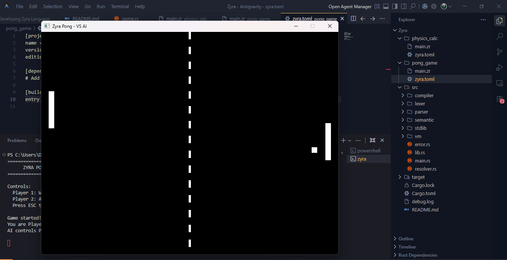

# Zyra Programming Language

A modern, safe, and deterministic programming language built in Rust.



## Overview

**Zyra** is a programming language designed for students, beginner programmers, and indie game developers who want **Rust-level memory safety** without Rust-level complexity.

Zyra focuses on clarity, safety, and practicality. It is capable of building complete **2D games** using only its standard library, making it suitable for learning language design, compiler construction, and simple game development.

---

## Features

- **Memory Safe**  
  Rust-inspired ownership, borrowing, and lifetime model with no garbage collector.

- **No Null Values**  
  Every value has a single owner, preventing null pointer bugs.

- **Type Inference**  
  Explicit typing is optional; the compiler infers types when possible.

- **Game Ready**  
  Built-in game module for simple 2D graphics and input.

- **Clean Syntax**  
  Minimal, readable syntax with explicit semicolons.

- **Human-Readable Errors**  
  Clear compiler errors with helpful messages and suggestions.

---

## File Extensions

Zyra source files support the following extensions:

- `.zr`
- `.zy`
- `.za`

---

## Quick Start

```bash
# Build Zyra
cargo build --release

# Run a program
cargo run -- run examples/hello.zr

# Check syntax and types
cargo run -- check examples/pong.zr

# Compile to bytecode
cargo run -- build examples/hello.zr
```

## Syntax Examples

### Variables

```zyra
let score = 0;              // Immutable, type inferred
let mut speed = 3;         // Mutable variable
let gravity: f32 = 9.8;    // Explicit type
```

### Functions

```zyra
func add(a: Int, b: Int) -> Int {
    a + b  // Last expression is return value
}

func longest<'a>(a: &'a String, b: &'a String) -> &'a String {
    if a.len() > b.len() { a } else { b }
}
```

### Control Flow

```zyra
if score > 10 {
    print("High score!");
} else {
    print("Keep trying");
};

for i in 0..5 {
    print(i);
};

while running {
    update();
};
```

### Game Development

```zyra
import game;

func main() {
    let win = Window(800, 600, "My Game");

    while win.is_open() {
        if input.key("W") {
            // Move up
        };

        win.clear();
        draw.rect(100, 100, 50, 50);
        win.display();
    };
};
```

## Standard Library

### IO Module

- `print(value)` - Print to stdout
- `println(value)` - Print with newline
- `input()` - Read line from stdin

### Math Module

- `abs(n)`, `min(a, b)`, `max(a, b)`
- `sqrt(n)`, `pow(base, exp)`
- `floor(n)`, `ceil(n)`, `round(n)`
- `sin(n)`, `cos(n)`, `pi()`
- `random(min, max)`, `clamp(v, min, max)`

### Time Module

- `now()` - Current time in milliseconds
- `sleep(ms)` - Sleep for milliseconds

### Game Module

- `Window(w, h, title)` - Create window
- `win.is_open()` - Check if window is open
- `win.clear()` - Clear screen
- `win.display()` - Display frame
- `input.key(name)` - Check key pressed
- `draw.rect(x, y, w, h)` - Draw rectangle

## Project Structure

```
Zyra/
├── Cargo.toml          # Rust project manifest
├── src/
│   ├── main.rs         # CLI entry point
│   ├── lib.rs          # Library root
│   ├── error.rs        # Error handling
│   ├── lexer/          # Tokenizer
│   ├── parser/         # Parser & AST
│   ├── semantic/       # Type checking & ownership
│   ├── compiler/       # Bytecode compiler
│   ├── vm/             # Virtual machine
│   └── stdlib/         # Standard library
└── examples/
    ├── pong.zr         # Complete Pong game
    ├── hello.zr        # Hello world
    └── ownership.zr    # Ownership demo
```

## Building from Source

Requirements:

- Rust 1.70 or later
- Cargo

```bash
git clone https://github.com/cowoksoftspoken/Zyra.git
cd Zyra
cargo build --release
```

The binary will be at `target/release/zyra`
some features not work right now.

## License

See [LICENSE](LICENSE) file.
