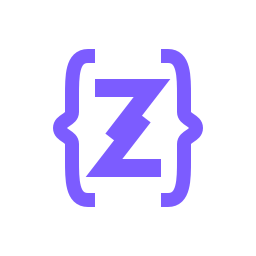

<div align="center">
  
  <h1>Zyra Programming Language</h1>

  <p>
    <strong>A modern, memory-safe programming language with ownership semantics</strong>
  </p>

  <p>
    <a href="https://github.com/cowoksoftspoken/Zyra/releases/latest">
      
    </a>
    <a href="LICENSE">
      
    </a>
    <a href="https://github.com/cowoksoftspoken/Zyra/actions">
      
    </a>
    
  </p>
  
  <h3>⚡ Powerful like Rust, readable like Python, productive like modern languages.</h3>
</div>

---

## Why Zyra?

Zyra is a **general-purpose programming language** designed for developers who want:

- **Memory safety without garbage collection** — ownership and borrowing prevent bugs at compile time
- **High performance** — compiles to efficient bytecode for fast VM execution
- **Clean, readable syntax** — inspired by Rust and Python for maximum clarity
- **Batteries included** — rich standard library for I/O, math, time, and more

Whether you're building **games**, **CLI tools**, **simulations**, or **learning systems programming** — Zyra provides a safe and productive environment.

---

## Key Features

| Feature                  | Description                                                                        |
| :----------------------- | :--------------------------------------------------------------------------------- |
| 🛡️ **Memory Safe**       | Ownership & borrowing system prevents data races and memory errors at compile time |
| ⚡ **High Performance**  | Compiles to optimized bytecode for deterministic, GC-free execution                |
| 📦 **Smart Modules**     | Clean namespace management with `import std::math`                                 |
| 🔧 **No Null**           | `Option` types eliminate null pointer errors                                       |
| 🎨 **Hex Literals**      | Express colors and flags naturally: `0xFF00FF`                                     |
| 🎮 **Built-in Graphics** | Optional 2D graphics library for games and visualizations                          |
| 🛠️ **Project CLI**       | `zyra init`, `run`, and `build` for seamless workflows                             |

---

## Use Cases

Zyra is **not just for games**. Here's what you can build:

### 🎮 Games & Simulations

Built-in 2D graphics library makes game development accessible.

### 🔬 Scientific Computing

Math library with `sqrt`, `abs`, `random`, `clamp` for calculations.

### 🖥️ CLI Applications

Fast startup, small binaries, no runtime dependencies.

### 📚 Learning Systems Programming

Understand ownership, borrowing, and memory management safely.

### 🧮 Physics & Math Tools

Create calculators, simulators, and educational tools.

---

## Quick Start

### 1. Create a Project

```bash
zyra init my_project
cd my_project
```

### 2. Write Code

```rust
// main.zr
func main() {
    let name = "World";
    println("Hello, ${name}!");

    // Math operations
    let result = calculate(10, 5);
    println("Result: ${result}");
}

func calculate(a: int, b: int) -> int {
    return a * b + 42;
}
```

### 3. Run

```bash
zyra run
```

---

## Syntax Showcase

### Variables & Types

```rust
let score = 0;              // Inferred as int
let mut speed = 5.5;        // Mutable float
let name: string = "Zyra";  // Explicit type
let color = 0xFF5733;       // Hex literal
```

### Structs & Methods

```rust
struct Player {
    name: string,
    score: int,
}

impl Player {
    func new(name: string) -> Player {
        Player { name, score: 0 }
    }

    func level_up(&mut self) {
        self.score += 100;
    }
}
```

### Control Flow

```rust
if score > 100 {
    println("High score!");
} else {
    println("Keep trying!");
}

for i in 0..10 {
    println(i);
}

while player.is_alive() {
    player.update();
}
```

### Graphics (Optional)

```rust
import std::game;
import std::time;

func main() {
    let win = Window(800, 600, "My App");

    while game::is_open() {
        game::clear();
        game::draw_rect(10, 10, 100, 50);
        game::display();
        time::sleep(16);
    }
}
```

---

## Standard Library

| Module        | Description                                          |
| :------------ | :--------------------------------------------------- |
| `std::io`     | Input/Output: `print`, `println`, `input`            |
| `std::math`   | Math: `abs`, `min`, `max`, `sqrt`, `random`, `clamp` |
| `std::time`   | Time: `now`, `sleep`, `delta_time`                   |
| `std::game`   | Graphics: Window, input handling, 2D drawing         |
| `std::string` | String utilities: `len`, `contains`, `split`         |
| `std::fs`     | File system: `read_file`, `write_file`               |

---

## Installation

### Windows

```powershell
cd installer
.\install.bat
```

### Linux / macOS

```bash
cd installer
chmod +x install.sh
./install.sh
```

### Build from Source

```bash
git clone https://github.com/cowoksoftspoken/Zyra.git
cd Zyra
cargo build --release
```

Requires **Rust 1.70+**. Binary will be at `target/release/zyra`.

---

## Project Configuration

Every project uses a `zyra.toml` file:

```toml
[project]
name = "my_project"
version = "1.0.0"
edition = "2025"
zyra = ">=1.0.0"

[build]
main_entry = "main.zr"
output = "./dist/"
```

---

## Contributing

We welcome contributions! See [CONTRIBUTING.md](CONTRIBUTING.md) for guidelines.

---

## License

Licensed under either of MIT License or Apache License 2.0 — see [LICENSE-MIT](LICENSE-MIT) and [LICENSE-APACHE](LICENSE-APACHE) for details.


---
